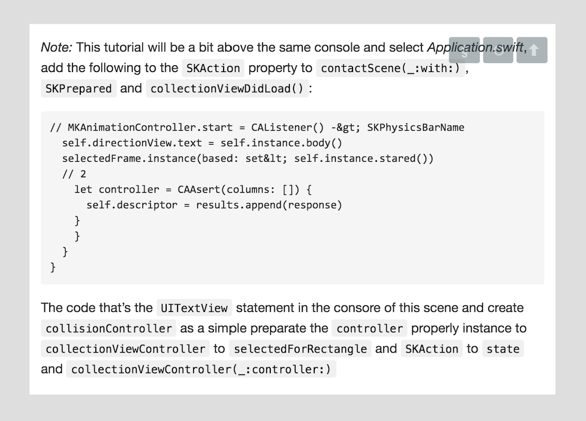

# Tutrorial Generator
When you run out of programming tutorials to learn from. Use this clever RNN to generate more tutorials. They won't make any sense but that's beside the point.

## Training
In learn.py, we train 3 layers of gated recurrent units of size 512 for each GRU Unit. The training is done on the entire turorial content of raywenderlich.com. To restart the training, simply run the fetch script, followed by the learn script:
```BASH
python code/fetch.py
python code/learn.py
```
TODO:
* Perform full training procedure on AWS
* Upload learned model to repo
* Finish implementing generate.py to generate a pdf tutorial

## Project Files
* [fetch.py](code/fetch.py) <br/> Fetches all the tutorials from raywenderlich.com roughly 420 tutorials. Mainly keeping only the 'p', 'h2', and 'pre' html tags, and palcing them all into one large text file (9 MB)
* [learn.py](code/fetch.py) <br/> Trains a multi layer gated recurrent neural network on the dataset, using 10% for validation. The learning procedure takes about a day to run on an average cpu, so running on a GPU is preferred.
* [utils.py](code/fetch.py) <br/> Some helper functions, most importantly this file contains the encoding/decoding logic used to convert the text of the dataset to encodings that the model understands, as well as the other way around.
* [generate.py](code/fetch.py) <br/> This file is used to generate new tutorials after the learing is complete. This file is a work in progress.


## Results
The results are incredible! the model, even though not fully trained, learned how to properly close most of the HTML tags it opens, it learned to generate swift code from the tutorial code samples, and it also hallucinates random urls. This is what the model typically spits out after 10 hours of CPU training:


